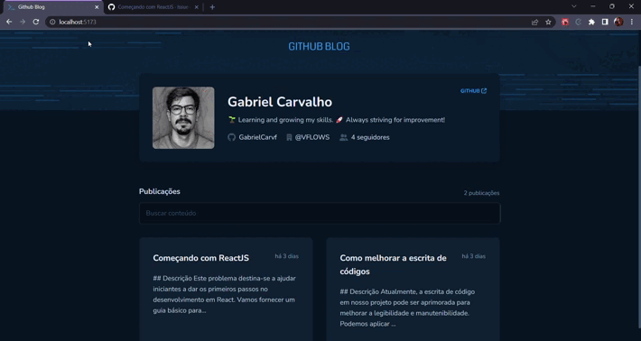

  
  
  <h2> <strong>GitHub Blog</strong> </h2>

  <h3>Suas issues transformadas em posts</h3>

   [Introdução](#-introdução) |
   [Utilização](#-utilizacao) |
   [Tecnologias Utilizadas](#-tecnologias-utilizadas) 

---

# 👨🏻‍💻 Introdução

## Objetivo

O objetivo principal dessa aplicação foi a integração com a API do GitHub para buscar issues de um repositório e mostrar as mesmas em formato de post como em um blog.

A criação dessa aplicação foi com o intuito de praticar e aprender mais sobre o desenvolvimento em [ReactJS](https://react.dev/) e suas tecnologias.

## Esse repositório possui

- Todo os arquivos de desenvolvimento da aplicação;
- Estruturação em componentes;
- Icons e SVGs utilizados na aplicação.

## Projeto

Esse projeto foi desenvolvido durante o curso Ignite da [Rocketseat](https://rocketseat.com.br/).

 

# 🗒️ Utilização

  
  

    
  

   

Acesse o blog e fique por dentro das issues do seu repositório.

Bastar acessar, buscar a issue que deseja acompanhar e ler o conteúdo detalhado.

 

# 🚀 Tecnologias/Bibliotecas utilizadas

- [ReactJS](https://react.dev/)
- [Axios](https://axios-http.com/)
- [Date-fns](https://date-fns.org/)
- [Use-debounce](https://www.npmjs.com/package/use-debounce)
- [React Markdown](https://www.npmjs.com/package/react-markdown)
- [Fontawesome Icons](https://fontawesome.com/icons)
- [Styled-components](https://styled-components.com/)

---

Made by

- [**Gabriel Carvalho**](https://github.com/GabrielCarvf) 🤘🏻|  [LinkedIn](https://www.linkedin.com/in/gabriel-carvalho-5ba636182/)
